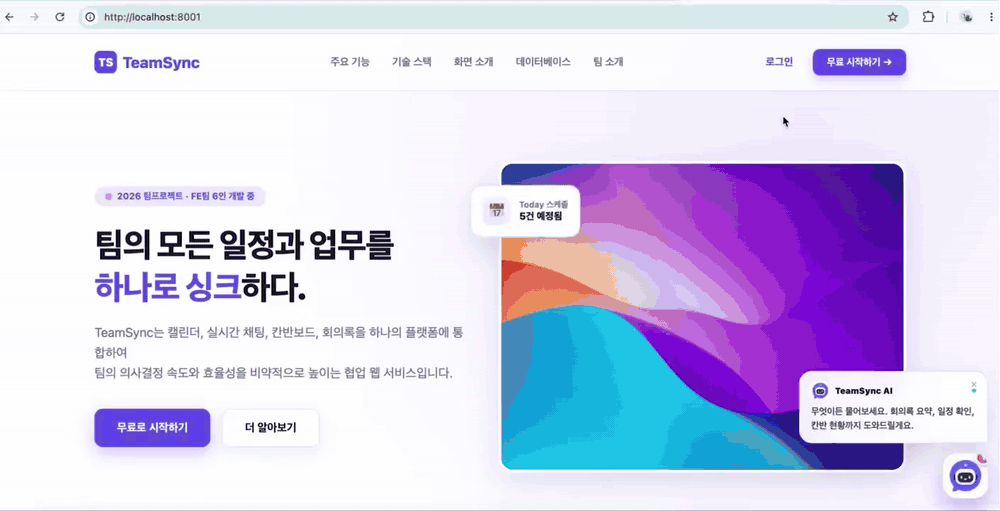
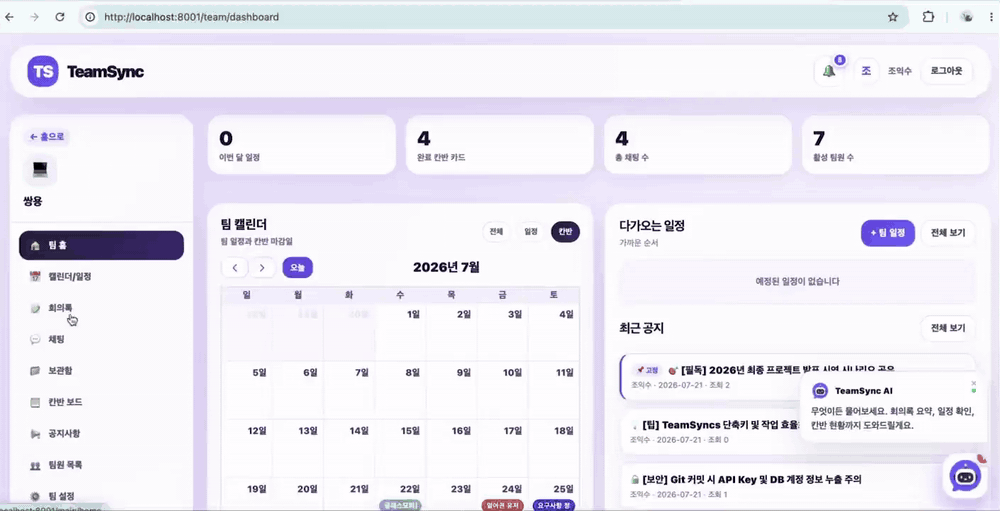
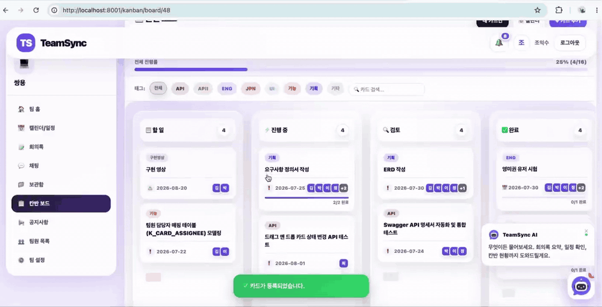
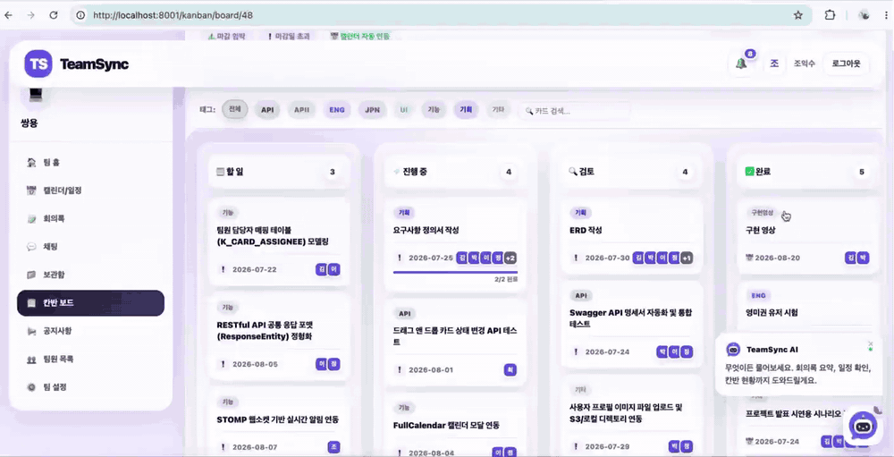
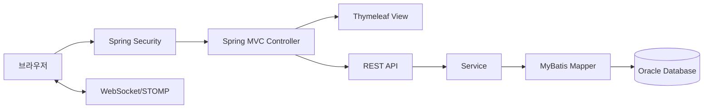
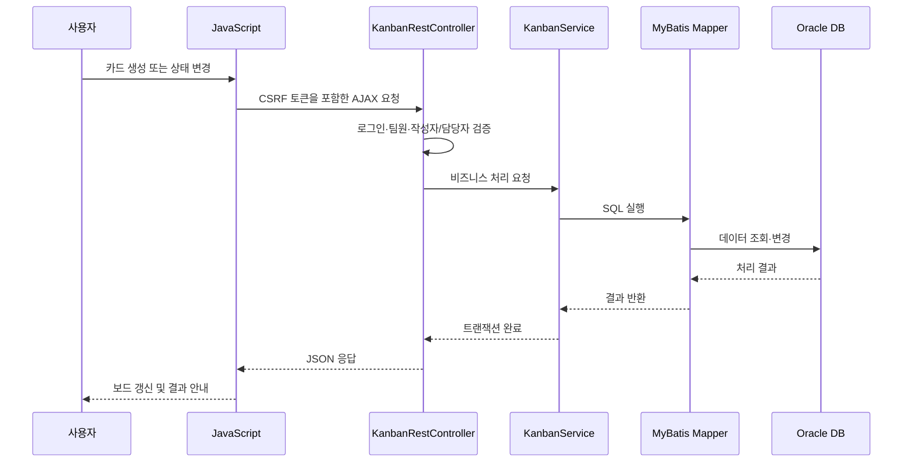

# TeamSyncs - 팀 협업·업무관리 플랫폼

팀 일정, 업무, 채팅, 공지와 알림을 하나의 공간에서 관리하는 Spring Boot 기반 협업 플랫폼입니다.

## 시연 영상

### TeamSync 프로젝트 협업 서비스

캘린더, 일정, 회의록, 채팅, 자료 보관함과 칸반보드를 하나의 서비스에서 이용할 수 있는
팀 프로젝트 협업 플랫폼입니다.

<br>



<br><br>

## 주요 기능

<details open>
<summary><strong>칸반 카드 등록</strong></summary>
<br>

업무 제목, 설명, 담당자, 마감일, 태그 등의 정보를 입력하여 새로운 업무 카드를 등록합니다.


</details>

<br>

<details>
<summary><strong>팀 협업 기능</strong></summary>
<br>

팀 대시보드에서 일정과 공지사항을 확인하고, 캘린더·회의록·채팅·자료 보관함 등
프로젝트 협업 기능으로 이동할 수 있습니다.


</details>

<br>

<details>
<summary><strong>드래그 앤 드롭 업무 상태 변경</strong></summary>
<br>

업무 카드를 드래그하여 할 일, 진행 중, 검토, 완료 단계로 이동시키고
변경된 업무 상태를 서버에 저장합니다.


</details>

<br>

<details>
<summary><strong>태그 필터 및 업무 검색</strong></summary>
<br>

업무 태그와 검색어를 이용하여 필요한 카드만 빠르게 조회할 수 있습니다.


</details>

<br>

<details>
<summary><strong>칸반보드 통합 관리</strong></summary>
<br>

전체 업무 진행률을 확인하고 내 카드 조회, 팀 캘린더 확인 및 카드 추가 등의
칸반보드 관리 기능을 제공합니다.


</details>

## 프로젝트 정보

| 구분 | 내용 |
| --- | --- |
| 개발 기간 | 2026.06.10 - 2026.07.28 |
| 프로젝트 형태 | 교육과정 팀 프로젝트 |
| 담당 영역 | 칸반 보드 |
| Backend | Spring Boot 3.5, Java 17 |
| Database | Oracle Database, MyBatis |
| View | Thymeleaf, HTML, CSS, JavaScript, jQuery |

## 프로젝트 목표

팀원이 일정, 업무, 공지와 대화를 각각 다른 도구에서 관리해야 하는 불편을 줄이기 위해 기획했습니다. 팀 생성과 초대부터 일정·회의록·실시간 채팅·칸반 보드·공지·알림까지 프로젝트 진행에 필요한 기능을 하나의 서비스에서 제공합니다.

## 주요 기능

- 이메일 회원가입, Spring Security 로그인 및 Google OAuth 2.0 로그인
- 팀 생성, 초대코드·이메일 초대, 팀원 역할 및 권한 관리
- FullCalendar 기반 팀 일정과 개인 통합 일정
- 일정과 연결된 회의록 작성 및 PDF 내보내기
- WebSocket/STOMP 기반 팀 채널 실시간 채팅
- 채팅 첨부파일을 유형·채널별로 조회하는 보관함
- 업무 상태를 시각화하는 칸반 보드
- 팀 공지사항과 AJAX 폴링 기반 알림
- Chart.js 기반 팀 활동 대시보드

## 담당 기능 - 칸반 보드

칸반 보드의 화면, REST API, 서비스, MyBatis Mapper 및 Oracle 테이블 연동을 구현했습니다.

### 1. 카드 목록과 검색

- 할 일, 진행 중, 검토 중, 완료의 네 단계로 업무 카드를 분류했습니다.
- 팀별 카드 목록을 조회하고 태그, 검색어 및 내 담당 카드 조건으로 필터링했습니다.
- 카드별 담당자와 체크리스트를 함께 조회해 진행률을 계산했습니다.
- 마감일과 체크리스트 완료 비율을 카드에서 바로 확인하도록 구성했습니다.

### 2. 카드 등록·수정·삭제

- 제목, 설명, 태그, 마감일, 담당자 및 첨부파일을 포함한 카드 CRUD를 구현했습니다.
- Jakarta Validation과 `BindingResult`로 요청값을 서버에서 검증했습니다.
- 카드와 다중 담당자 정보가 함께 저장되도록 서비스 계층에 트랜잭션을 적용했습니다.
- 카드 수정 시 기존 담당자 관계를 정리한 후 새로운 담당자 목록을 일괄 반영했습니다.

### 3. 드래그 앤 드롭 상태 변경

- HTML Drag and Drop 이벤트로 카드를 다른 업무 단계로 이동하도록 구현했습니다.
- 상태 변경을 AJAX 요청으로 처리하고 성공 후 보드 데이터를 다시 조회했습니다.
- 요청 실패 시 화면을 서버 상태로 복구하고 사용자에게 오류 메시지를 표시했습니다.
- 작성자 또는 담당자만 카드 상태를 변경할 수 있도록 서버에서 권한을 검사했습니다.

### 4. 체크리스트와 진행률

- 카드별 체크리스트 추가, 완료 상태 변경 및 삭제 기능을 구현했습니다.
- 완료 항목 수와 전체 항목 수를 기준으로 진행률을 계산했습니다.
- 체크리스트 조작에도 카드 작성자·담당자 권한 검증을 적용했습니다.

### 5. 댓글과 담당자 관리

- 카드 댓글 등록·조회·수정·삭제 기능을 구현했습니다.
- 댓글 수정과 삭제 시 로그인 사용자와 댓글 작성자가 일치하는지 확인했습니다.
- 하나의 카드에 여러 팀원을 지정할 수 있는 다대다 담당자 구조를 구현했습니다.
- 카드 상세 화면에서 담당자를 추가하거나 제거하도록 AJAX 기반으로 처리했습니다.

### 6. 팀 단위 접근 제어

- URL의 팀 번호와 세션에 저장된 현재 팀 번호가 일치하는지 검사했습니다.
- 로그인 사용자가 실제 해당 팀의 구성원인지 DB에서 다시 확인했습니다.
- 카드 조회·수정 요청에 팀 번호 조건을 포함해 다른 팀의 데이터 접근을 방지했습니다.
- 변경 요청에 Spring Security CSRF 토큰을 포함했습니다.

## 문제 해결 경험

### 빠른 연속 클릭으로 카드가 중복 생성되는 문제

카드 등록 요청이 끝나기 전에 사용자가 버튼을 여러 번 누르면 동일한 카드가 여러 건 저장될 수 있었습니다.

다음과 같이 개선했습니다.

1. 요청 시작 시 버튼에 `requesting` 상태를 저장했습니다.
2. 버튼을 비활성화하고 문구를 `처리 중...`으로 변경했습니다.
3. 이미 처리 중인 버튼에서 발생한 추가 요청을 차단했습니다.
4. 요청이 실패하면 버튼 상태와 원래 문구를 복구했습니다.

이를 통해 사용자 경험을 개선하고 불필요한 중복 요청을 줄였습니다. 다만 프런트엔드 제어만으로 모든 중복 요청을 방지할 수 없기 때문에, 실무에서는 멱등성 키나 DB 제약조건 같은 서버 측 방어도 함께 검토해야 한다는 점을 배웠습니다.

## 기술 스택

| 영역 | 기술 |
| --- | --- |
| Backend | Java 17, Spring Boot 3.5, Spring MVC |
| Security | Spring Security, BCrypt, OAuth 2.0, CSRF |
| Persistence | MyBatis, Oracle Database, HikariCP |
| Frontend | Thymeleaf, HTML5, CSS3, JavaScript, jQuery, Ajax |
| Realtime | WebSocket, STOMP |
| UI Library | FullCalendar.js, Chart.js |
| Build | Gradle |

## 시스템 구조



칸반 요청 처리 흐름:



## 데이터베이스

회원, 팀, 초대, 일정, 회의록, 칸반, 채팅, 파일, 알림, 공지와 챗봇 로그를 포함한 24개 테이블로 구성했습니다.

칸반 관련 테이블:

- `KANBAN_CARD`: 카드 기본 정보와 업무 상태
- `KANBAN_ASSIGN`: 카드와 담당자 간 다대다 관계
- `KANBAN_CHECKLIST`: 카드별 체크리스트와 완료 상태
- `KANBAN_COMMENT`: 카드별 댓글

## 보안 및 데이터 정합성

- Spring Security와 BCrypt를 이용해 인증과 비밀번호 암호화를 처리했습니다.
- Google OAuth 2.0 연동 정보를 외부 설정으로 분리했습니다.
- 칸반 요청마다 현재 팀과 실제 팀원 여부를 서버에서 검증했습니다.
- 작성자·담당자 권한과 댓글 작성자 권한을 서버에서 확인했습니다.
- AJAX 변경 요청에 CSRF 토큰을 전송했습니다.
- 여러 테이블을 함께 변경하는 카드·담당자 작업에 트랜잭션을 적용했습니다.
- DB, 메일, OAuth 및 API 비밀정보를 `data-config.yml`로 분리하고 Git에서 제외했습니다.
- 실제 업로드 파일은 Git에 포함하지 않고 저장 경로만 관리합니다.

## 실행 방법

### 준비 환경

- Java 17
- Oracle Database

### 로컬 설정

1. `src/main/resources/data-config.yml.example`을 복사합니다.
2. 복사한 파일명을 `data-config.yml`로 변경합니다.
3. 로컬 DB, 메일, OAuth 및 API 설정값을 입력합니다.
4. 실제 `data-config.yml`은 Git에 커밋하지 않습니다.

### 실행

```bash
./gradlew bootRun
```

기본 서버 포트는 `8001`입니다.

## 프로젝트를 통해 배운 점

- Controller-Service-Mapper 계층을 분리하며 Spring MVC 요청 처리 구조를 익혔습니다.
- 카드, 담당자, 체크리스트와 댓글 관계를 설계하며 관계형 데이터 모델링을 경험했습니다.
- 화면에서 버튼을 숨기는 것만으로는 권한을 보호할 수 없으며 서버 검증이 필수임을 배웠습니다.
- AJAX의 성공·실패 상태를 구분하고 HTTP 상태별 사용자 피드백을 제공했습니다.
- 트랜잭션을 통해 카드와 담당자 정보가 부분적으로 저장되는 문제를 방지했습니다.
- 프런트엔드 중복 요청 차단과 서버 측 멱등성 보장이 서로 다른 방어 계층이라는 점을 이해했습니다.

## 담당자

- 조승근 - 칸반 보드 구현

